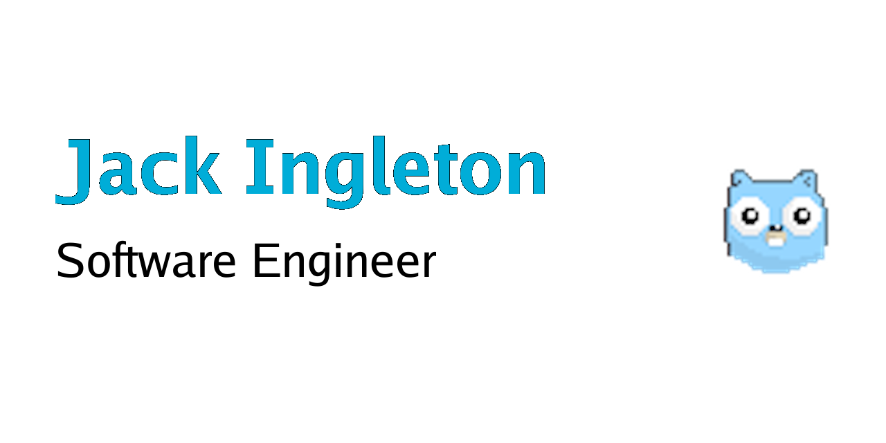

## Hi, I'm Jack 👋

*Header created in Go, using [github.com/golang/freetype/truetype](https://github.com/golang/freetype/truetype) and [golang.org/x/image/font](https://pkg.go.dev/golang.org/x/image/font). Gopher image from [https://github.com/egonelbre/gophers](https://github.com/egonelbre/gophers).* 
___

- 👋 Hi, I’m @JackIngleton
- 👀 I’m interested in ...
- 🌱 I’m currently learning ...
- 💞️ I’m looking to collaborate on ...
- 📫 How to reach me ...
___

___

